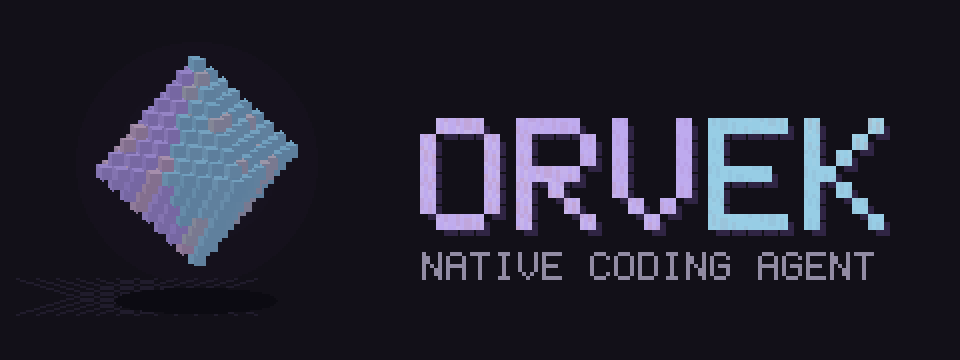
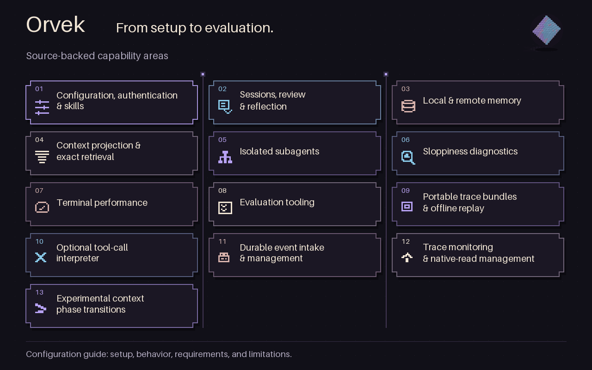
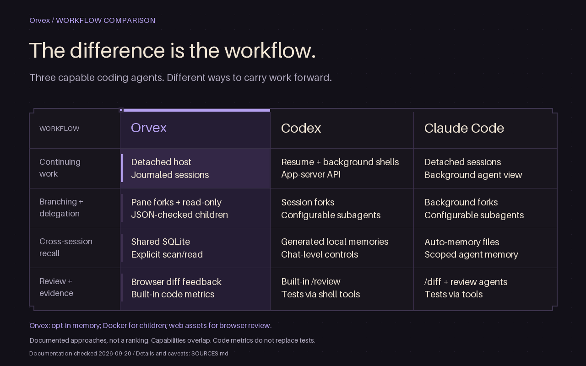

# Orvek

<picture>
  <source media="(prefers-reduced-motion: reduce)" srcset="assets/orvek-logo.png">
  
</picture>

Orvek is a native coding agent for the terminal. It works with local files and shell commands,
keeps resumable sessions, and uses your configured model provider for inference.

## Features

- Read, edit, and inspect code with local tools.
- Resume conversations or fork a session into a separate thread.
- Share local SQLite memory across sessions using the same configuration.
- Keep accepted work and resumable context in a detached durable host.
- Delegate tasks to child agents and collect structured results.
- Review diffs in a browser and send feedback to the agent.
- Add local skills and MCP tools.

By default, shell commands run with your permissions. The optional Docker runtime provides
isolated verification and read-only child agents; see [Subagents](docs/subagents.md).

## Workflow overview



## Differentiators



This compares documented workflows, not benchmark results or exclusive features.
Capabilities overlap. Memory is opt-in, child agents require Docker, and browser review
requires web assets. Code metrics do not replace tests.

Sources checked 20 September 2026: [Codex CLI](https://developers.openai.com/codex/cli/reference),
[Codex memory](https://developers.openai.com/codex/customization/memories),
[Codex subagents](https://developers.openai.com/codex/multi-agent),
[Claude Code background sessions](https://code.claude.com/docs/en/agent-view),
[Claude Code memory](https://code.claude.com/docs/en/memory), and
[Claude Code subagents](https://code.claude.com/docs/en/sub-agents).

## Install

Requires Rust 1.97 or newer and a C toolchain. Orvek currently ships from source:

```sh
git clone https://github.com/pkmdev-sec/orvek.git
cd orvek
cargo install --locked --path bin/orvek
```

No Orvek crate, signed binary release, or container image is published yet.

## Start

Sign in, then open the terminal session:

```sh
orvek auth login
orvek
```

Or use `OPENAI_API_KEY` with `orvek --auth api-key`. By default, Orvek shares the Codex auth file.
`orvek auth logout` also signs Codex out of that file.

```sh
orvek run "inspect this repository"   # Stream JSONL events.
orvek --model terra                  # Select a model for a new session.
orvek resume                        # Open the session picker.
orvek --resume SESSION_ID           # Resume a known session.
```

## Local shared memory

Add this to your configuration and start a new session:

```toml
[memory]
enabled = true
```

Leave `memory.remote` unconfigured for local-only memory. Sessions share
`<config-dir>/memory/v1.sqlite3`; no Cloudflare service is needed. Agents read memory through
explicit tools. Memory is separate from durable session history.

## Configure and update

```sh
orvek config path
orvek config show
cargo install --git https://github.com/pkmdev-sec/orvek --locked --bin orvek
```

The default configuration is `~/.orvek/config.toml`. See the configuration guide for path overrides
and saved-data handling.

## Guides

- [Configuration, authentication, skills, and MCP](docs/configuration.md)
- [Sessions, review, and reflection](docs/sessions.md)
- [Local and remote memory](docs/memory.md)
- [Context projection and legacy compaction data](docs/compaction.md)
- [Subagents](docs/subagents.md)
- [Sloppiness diagnostics](docs/sloppiness.md)
- [Performance notes](docs/performance.md)
- [Evaluations](evals/README.md)
- [Release setup](RELEASES.md)

## Development

```sh
cargo check --all-features
just check-fmt
just clippy
just test
python3 scripts/check-source-tree.py
```

`just` uses nightly Rust for formatting and `cargo-nextest` for tests. Local agent state,
credentials, and build outputs must stay out of Git.

## License

Orvek is distributed under [Apache-2.0](LICENSE.md). Attribution and dependency notices, including
the remaining Nanocodex-derived support crates, are in [NOTICE.md](NOTICE.md) and `vendor/`.
