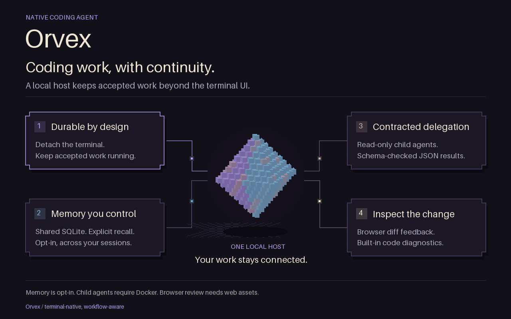

# Orvex marketing visuals

Two matching 1280 × 800 animated diagrams, each with an eight-second loop at 25 fps.
Open [preview.html](preview.html) to view both videos and download individual formats.
The preview has playback controls and respects reduced-motion preferences.

| Visual | Animated images | Video | Static fallback |
| --- | --- | --- | --- |
| Differentiators | [GIF](orvex-differentiators.gif), [WebP](orvex-differentiators.webp) | [MP4](orvex-differentiators.mp4) | [PNG](orvex-differentiators.png) |
| Competitor comparison | [GIF](orvex-comparison.gif), [WebP](orvex-comparison.webp) | [MP4](orvex-comparison.mp4) | [PNG](orvex-comparison.png) |

The content uses **Orvex**, **Codex**, and **Claude Code**. The underlying CLI and
repository are not renamed by this artwork. The comparison describes workflows,
not a feature-absence scorecard. See [sources and qualifications](SOURCES.md).

## Deployment

- Use MP4 on landing pages. Keep native playback controls and a PNG poster.
- Use animated WebP where supported. Use GIF for broadly compatible embeds.
- Use PNG in slide decks, print layouts, or reduced-motion contexts.
- Keep the comparison's qualifications visible. Link to `SOURCES.md` or publish
  its contents beside the visual. Features can change after the checked date.
- Do not crop out the Docker, memory, browser-asset, or diagnostic qualifications.

For an image embed:

```html
<picture>
  <source media="(prefers-reduced-motion: reduce)" srcset="orvex-differentiators.png">
  <source type="image/webp" srcset="orvex-differentiators.webp">
  
</picture>
```

Animations should have a pause control when displayed on a web page. The supplied
preview uses video controls; a standalone animated image has no built-in pause UI.

## Rebuild in the source repository

```sh
uv run scripts/generate-marketing-visuals.py --frames
uv run scripts/generate-marketing-visuals.py --check
```

The pinned Pillow generator uses `content.json` and the existing pixel-art diamond
from `assets/orvek-logo.gif`. It writes GIF, animated WebP, PNG, and temporary video
frames under `.agent-map/orvex-marketing/frames/`. It does not alter that logo.
Encode each frame directory with the installed FFmpeg:

```sh
ffmpeg -y -framerate 25 -i .agent-map/orvex-marketing/frames/orvex-differentiators/%03d.png -an -c:v libx264 -preset slow -crf 18 -pix_fmt yuv420p -movflags +faststart assets/marketing/orvex-differentiators.mp4
ffmpeg -y -framerate 25 -i .agent-map/orvex-marketing/frames/orvex-comparison/%03d.png -an -c:v libx264 -preset slow -crf 18 -pix_fmt yuv420p -movflags +faststart assets/marketing/orvex-comparison.mp4
```

## Artwork

The dark background, violet/cyan/cream/pink palette, stepped cards, and rotating
voxel diamond follow the existing logo. Labels remain readable throughout both
loops. The artwork contains no competitor logos, external illustrations, or
external font files. Raster text uses Pillow's built-in font.
