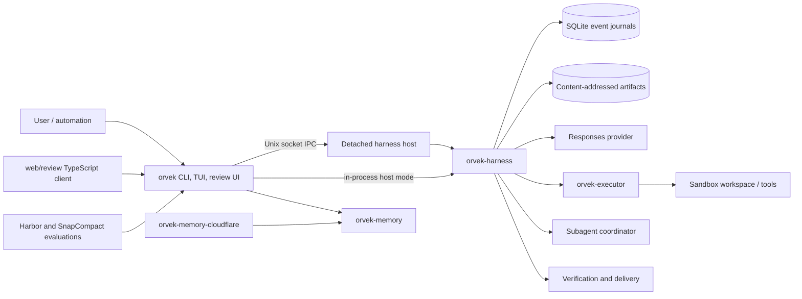

# Codebase architecture and review

**Repository:** `/Users/pumaurya/orvek`  
**Reviewed revision:** `98ae1e120dc0253917a70108c918846e5058b0de` (`feat/language-agnostic-sloppiness`)  
**Review date:** 2026-09-19

This is a historical snapshot. The later macOS distribution change removed the standalone
Cloudflare/WASM example and Linux release artifacts; its findings remain evidence for the reviewed
revision, not a current component inventory.

## Executive summary

Orvek has strong authority boundaries. The harness owns durable task state, provider calls, sandbox execution, verification, and delivery. Frontends consume the host protocol instead of duplicating that authority. The repository also has broad automated coverage: the full Rust suite, clippy, formatting, web tests, graph checks, documentation checks, and component wiring audit all passed.

The review found two verified runtime defects, one verified release defect, two coverage/graph gaps, and one provider-limit risk. No critical security defect was confirmed.

| Priority | Finding | Classification |
|---|---|---|
| P1 | Online bitmap selection cannot form the comparable receipt pairs its estimator requires | Verified correctness/design defect |
| P1 | Headless event streaming permanently stops reconnecting after three lifetime reconnect attempts | Verified reliability defect |
| P2 | Release binaries and archives are not reproducible from a revision | Verified release defect |
| P2 | Runnable evaluation suites are absent from CI | Verification gap |
| P3 | The curated component graph leaves the subagent subsystem isolated | Graph defect |
| P2 | Context admission converts tokens to bytes with a fixed `4 bytes/token` estimate and does not reserve output tokens | Unverified provider-limit risk |


## Remediation status

All six findings were addressed in the post-review working tree on 2026-09-19:

| Finding | Remediation |
|---|---|
| Bitmap comparison | Compare one native/bitmap input pair with the active provider's non-generating input-token count endpoint; persist the exact pair and fall back to native on failure. |
| Headless reconnects | Count consecutive subscription failures and reset the budget after each successful subscription. |
| Reproducible releases | Derive `SOURCE_DATE_EPOCH` from the tagged commit and package sorted archives with normalized gzip, tar, owner, mode, and timestamp metadata. |
| Evaluation CI | Run locked Harbor adapter and SnapCompact accounting tests in `ci.yaml`. |
| Isolated subagent graph node | Add `component:harness -> component:subagents` and reject isolated curated components in generator tests. |
| Context sizing | Reserve up to 32,768 output tokens, reserve half of small windows, and admit projected input at a conservative one serialized byte per input token. |

The validation results for this remediation belong to the working tree, not the reviewed revision named above.

## Architecture and dependency graph



### Workspace package dependencies

```text
orvek
├── orvek-harness
│   └── orvek-executor
└── orvek-memory

orvek-memory-cloudflare
└── orvek-memory
```

At the time of this review, the workspace patched vendored `nanocodex-agent` and
`nanocodex-oai-api` packages. They were removed in the later maintainability-baseline change.
External dependency relationships for the reviewed snapshot were present in its machine-readable
graph.

### Generated module graph

The repository's deterministic graph was validated rather than overwritten because `docs/codebase-graph/graph.json` already contained local work.

- [`docs/codebase-graph/graph.json`](../codebase-graph/graph.json): machine-readable graph
- [`docs/codebase-graph/architecture.dot`](../codebase-graph/architecture.dot): Graphviz architecture view
- [`docs/codebase-graph/overview.md`](../codebase-graph/overview.md): human-readable module map
- [`scripts/generate-codebase-graph.py`](../../scripts/generate-codebase-graph.py): generator

Current graph size:

- **1,145 nodes:** 533 files, 356 modules, 7 packages, 72 external dependencies, 14 curated components, and 46 build targets.
- **2,199 edges:** package dependencies, workspace membership, module declarations, local and external imports, includes, target implementations, and curated runtime relationships.
- Important static edge counts include 310 `declares_module`, 155 `depends_on`, 116 `imports`, 64 `imports_local`, and 19 `includes` edges.

`python3 scripts/generate-codebase-graph.py --check` passed. `just audit-components` also confirmed that 180 Rust, 13 Python, and 34 TypeScript modules are reachable.

## Findings

### P1 — Online bitmap selection cannot produce comparable measurements

**Evidence**

- The estimator accepts a native/bitmap pair only when `source_history` is identical: `crates/harness/src/context_cost.rs:93-123`.
- Every observation sets `source_history` to the full projection history digest: `crates/harness/src/controller.rs:3203-3209`.
- A successful provider response is appended to the session before another inference request can be made: `crates/harness/src/controller.rs:1748-1768`.
- The online profile reads only receipts for the current task: `crates/harness/src/controller.rs:3090-3111`.
- Once a native observation exists, the next eligible call samples bitmap. Once any bitmap observation exists without a valid pair, the recommendation falls back to native: `crates/harness/src/context_cost.rs:148-168` and `crates/harness/src/controller.rs:3114-3141`.

**Impact**

In a normal append-only task, the history digest changes between model calls. A native observation and the later bitmap sample therefore cannot satisfy the estimator's equality test. The selector samples bitmap once, then returns to native without learning whether bitmap is cheaper. The documented measured-cost selection cannot converge during normal use.

**Fix**

Create an explicit measurement boundary that compares both forms against the same immutable request snapshot. An opt-in probe can send native and bitmap requests, discard probe output, and persist the resulting segment/model estimate outside one task. If duplicate provider calls are unacceptable, use deterministic provider-token measurements for each representation instead of comparing whole calls. Add an append-only multi-call regression test that proves the selector reaches and retains a measured decision.

### P1 — Headless streaming exhausts a lifetime reconnect counter

**Evidence**

- `reconnects` starts once for the whole submission: `bin/orvek/src/app/headless.rs:79`.
- Every reconnect attempt increments it, including successful attempts: `bin/orvek/src/app/headless.rs:148-150`.
- Neither a successful subscription nor a successfully received frame resets it: `bin/orvek/src/app/headless.rs:150-160`.
- After the third lifetime attempt, `watch.is_none()` no longer starts another subscription because of `reconnects < 3`.

**Impact**

A long-running headless task that experiences three separate watch disconnects permanently loses live journal events. Status polling can still discover the final receipt, but intermediate output is omitted. The final five-second drain can emit only `view_gap` if it cannot catch up.

**Fix**

Count consecutive reconnect failures, not lifetime attempts. Reset the counter after a successful subscription or valid frame. Add a test with more than three disconnect-success cycles and assert that later journal frames remain visible.

### P2 — Release artifacts are not reproducible from a revision

**Evidence**

- The build script embeds `SystemTime::now()` when `SOURCE_DATE_EPOCH` is absent: `bin/orvek/build.rs:77-95`.
- The release build sets only `ORVEK_RELEASE_BUILD`; it does not set `SOURCE_DATE_EPOCH`: `.github/workflows/release.yaml:80-84`.
- Packaging uses default `tar -czf`, which also retains filesystem metadata and gzip timestamps: `.github/workflows/release.yaml:84-94`.

**Impact**

Two release runs from the same commit and lockfile can produce different binaries, archives, checksums, and signatures. This weakens independent provenance verification and makes release incident comparison harder.

**Fix**

Derive `SOURCE_DATE_EPOCH` from the tagged commit timestamp. Normalize archive owner, group, order, modes, and mtimes. Use deterministic gzip flags. Add a release test that builds and packages the same revision twice and compares SHA-256 digests.

### P2 — Evaluation suites are not enforced in CI

**Evidence**

- CI runs graph-generator unit tests at `.github/workflows/ci.yaml:22-25`, but the workflow contains no `evals`, `harbor`, `snapcompact`, or `uv run` step.
- Runnable tests exist in `evals/harbor_adapter/test_agent.py`, `evals/snapcompact/test_paired_report.py`, and `evals/snapcompact/test_score.py`.
- The correct pinned Harbor invocation passed locally: `uv run --project evals python -m unittest harbor_adapter.test_agent -v` (28 tests).

**Impact**

Adapter safety contracts and evaluation accounting can regress while required CI remains green. This is important because evaluation totals and paired-representation accounting are not covered by the normal Rust workspace suite.

**Fix**

Add a locked `uv` CI job for the Harbor tests and direct Python jobs for the SnapCompact accounting tests. Keep provider-backed evaluations separate and opt-in; the deterministic contract tests should be required.

### P3 — The curated graph omits subagent relationships

**Evidence**

- `component:subagents` is declared at `scripts/generate-codebase-graph.py:123`.
- The curated `COMPONENT_EDGES` list begins at line 142, but no edge references `component:subagents`.
- The generated component node consequently has zero incoming and zero outgoing component-level edges even though the harness invokes the subagent coordinator.

**Impact**

File-level module/import relationships remain present, but the architecture view falsely presents a major runtime subsystem as isolated. This can mislead onboarding and change-impact review.

**Fix**

Add at least `component:harness -> component:subagents` with an `orchestrates` or `delegates_to` relationship. Add a generator test that rejects non-root curated components with degree zero.

## Architectural risks

### Provider context limits use a byte heuristic

`projection_byte_limit` converts the configured token window with a fixed four-bytes-per-token ratio, and `request_byte_limit` adds a fixed 1 MiB envelope: `crates/harness/src/context.rs:15-42`. The controller projects to that full amount (`crates/harness/src/controller.rs:1439-1441`) and separately requests up to 32,768 output tokens (`crates/harness/src/controller.rs:1568-1575`). The wire request disables provider truncation (`crates/harness/src/inference/protocol.rs:323-331`).

This is not a confirmed defect because actual provider tokenization and server limits were not available in the review environment. It is a material risk for code-heavy, non-ASCII, or image-heavy prompts: four bytes per token is not an upper bound, and the configured window does not visibly reserve output capacity. Use a model-specific tokenizer or a conservative measured bound, reserve output tokens, and test adversarial byte/token ratios against provider admission.

### Change concentration

Several modules combine many responsibilities and create wide review surfaces:

- `bin/orvek/src/tui/components/root.rs`: 6,585 lines
- `bin/orvek/src/tui/components/transcript/mod.rs`: 3,992 lines
- `bin/orvek/src/app/config.rs`: 3,761 lines
- `crates/harness/src/store.rs`: 3,599 lines
- `crates/harness/src/controller.rs`: 3,493 lines
- `bin/orvek/src/review/server.rs`: 3,027 lines

This is not evidence of incorrect behavior. It raises change-coupling and reviewer-load risk, especially where persistence, authority, and recovery logic share one module. Split only along existing authority boundaries; do not add wrapper layers solely to reduce line counts.

## Validation

All commands were run from `/Users/pumaurya/orvek` without rewriting the existing generated graph.

| Check | Result |
|---|---|
| `just test --locked` | Passed: 1,127 tests; 40 skipped by nextest filters |
| `cargo check --all-features` | Passed |
| `just clippy --all-features` | Passed with `-D warnings` |
| `just check-fmt` | Passed |
| `python3 scripts/check-source-tree.py` | Passed; all 352 tracked Rust files reachable |
| `python3 scripts/check-docs.py` | Passed for 37 tracked first-party docs; this new report’s local links were also resolved manually |
| `python3 scripts/generate-codebase-graph.py --check` | Passed |
| `just audit-components` | Passed: 180 Rust, 13 Python, 34 TypeScript modules |
| `python3 -m unittest discover -s scripts/tests -p "test_*.py" -v` | Passed: 11 tests |
| `bun test --cwd web/review` | Passed: 64 tests |
| Harbor adapter tests through `uv --project evals` | Passed: 28 tests |
| SnapCompact paired-report and score tests | Passed: 6 tests |

The direct system-Python Harbor invocation fails because Harbor is intentionally supplied by the pinned `evals` environment. The `uv run --project evals ...` result above is the relevant result.

## Review limits

- The repository was already dirty. Existing changes in `AGENTS.md`, `docs/codebase-graph/graph.json`, `docs/design/tui-motion.md`, `.agent-map/`, `CODEBASE.md`, and `evals/incident_replay/` were preserved.
- Provider-backed live evaluations were not run. They require credentials and could incur cost.
- The static graph records declared and syntactically discoverable relationships. Dynamic dispatch, runtime configuration, and protocol semantics still require source and test review.
